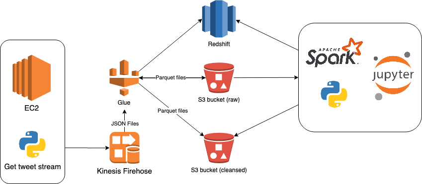

# Kinesis Twitter Watcher

Kinesis Twitter Watcher is a script to get a Twitter streaming and send the data to Amazon Kinesis. You can watch any tags you want, get and send tweets about them to Amazon Kinesis.

I used this as part of a personal Data Lake project. You can see the big picture below.



However, you can use this script however you want.

### Installation

You need to have Python 3.6+ in your development environment to run this script.

In order to install all dependencies, you can simply run this command.

```
pip install -r requirements.txt
```

For production environments...

I strongly recommend using a virtual environment.

### Config file

Before run this script you need to create a Kinesis Stream and a developer account on Twitter. You will fill `config.ini` file with your own config info provided by Twitter and AWS.


### Running

To run this script you need to send the tags you want to watch as argument, using comma as delimiter. 

```
python watch.py bolsonaro,bonoro,bozonaro,bolsomito,mito,mitonaro,salnorabo,coiso,bonossauro
```

